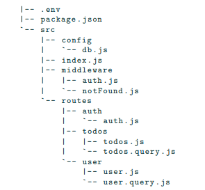
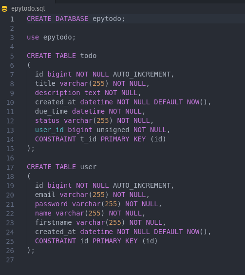
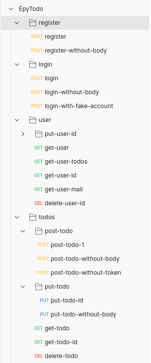

# EpyTodo

## Warning :warning:

I want to specify that for this project, \
I was a beginner in programming.\
Moreover, I had never used JavaScript,\
Despite this, I got 21/22 in the correction.
 
## Description :sunrise_over_mountains:

The project idea is to build a Todo List. \
Thanks to it, you’ll be able to handle all the tasks you need to do easily! \
We will mainly focus on the “backend” side of the project,\
but feel free to show us what you can by building a “frontend” to your project as a bonus.\
Within this project, you’ll have to develop:\
    &nbsp;&nbsp;&nbsp;&nbsp;&nbsp;&nbsp;1. your MySQL database.\
    &nbsp;&nbsp;&nbsp;&nbsp;&nbsp;&nbsp;2. A web server using Node.js


Here is the architecture I set up for the project :

<p align="center">
    <br/>
  
  <br/>
  <br/>
</p>

We also made a SQL script to create the database quickly : 

<p align="center">
    <br/>
  
  <br/>
  <br/>
</p>

## Installation :mag_right:

```
 git clone https://github.com/Mikatech/EpyTodo.git
 cd EpyTodo
 npm install
```

## Start project :checkered_flag:

```
npm start
```

You can use curl to perform your queries afterwards \
or use the repository's postman collection which has all possible queries

## Results :trophy:

|                          Label                        |      Mark       |
|:----------------------------------------------------------:|:------------------:|
|           Preliminaries | 2 / 2 |
| Architecture Web Server    | 5 / 5        |
| Routes (does it exists)           | 3 / 3        |
| Routes (Is it well done) | 3 / 3  |
|Password|1 / 1|
|Token|3 / 3|
|SQL DB | 4 / 5 |

## Bonus :package:

As a bonus, I have created a postman collection that allows you to test all the requests of the project,\
feel free to use it if you need it.

<p align="center">
    <br/>
  
  <br/>
  <br/>
</p>


------------
## Maintainers :sunglasses:

 - [Mikaël Vallenet](https://github.com/Mikatech)
 - [David Gozlan](https://github.com/Davphla)
